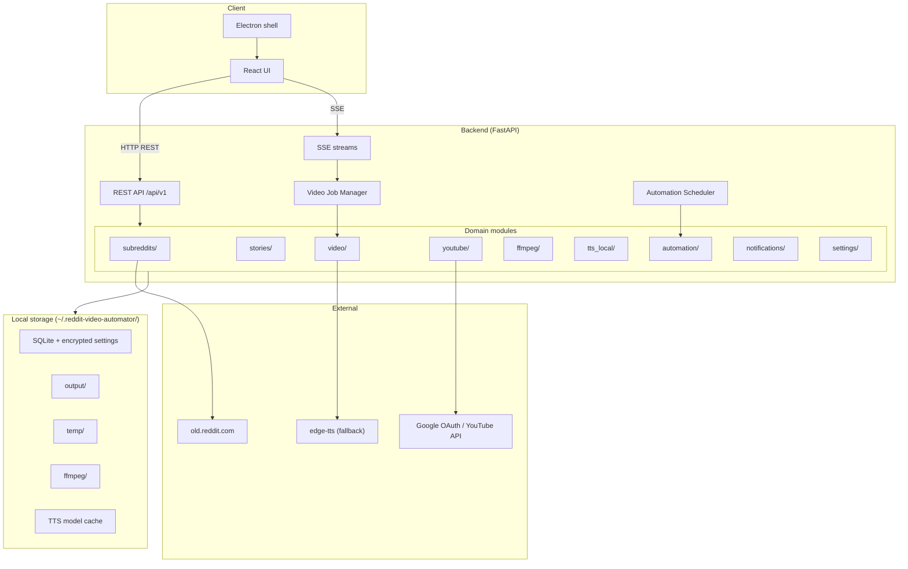
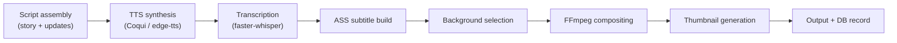

# Reddit Video Automator

An end-to-end pipeline that fetches Reddit stories, links multi-part updates, generates narrated videos with stylized subtitles, and publishes them to YouTube. The project ships as a FastAPI backend, a React desktop/web UI, and an Electron wrapper for single-user local operation.

---

## Table of Contents

- [Overview](#overview)
- [Features](#features)
- [Technology Stack](#technology-stack)
- [Architecture](#architecture)
- [Prerequisites](#prerequisites)
- [Installation](#installation)
- [Configuration](#configuration)
- [Usage](#usage)
- [Data and Storage](#data-and-storage)
- [Directory Structure](#directory-structure)
- [Development](#development)
- [License](#license)

---

## Overview

Reddit Video Automator turns Reddit text posts into ready-to-upload YouTube videos. It monitors subreddits, deduplicates fetched posts, detects and links story updates (separate posts and inline sections), then runs a local media pipeline: text-to-speech narration, word-level subtitle generation, background video compositing, thumbnail creation, and YouTube upload.

The system is designed to run entirely on your machine. Narration and transcription use local models (Coqui TTS and faster-whisper). Reddit content is fetched via public JSON endpoints without OAuth. YouTube is the only external service that requires credentials.

---

## Features

### Content pipeline

- **Reddit fetching** — Pull top, hot, or new posts from monitored subreddits via `old.reddit.com` JSON endpoints; deduplication prevents re-fetching.
- **Update detection and linking** — Identifies follow-up posts (e.g. "UPDATE", "Part 2") and inline update sections; builds parent/child story chains.
- **Story management** — Paginated listing, search, filtering, sorting, and per-story detail views.

### Media generation

- **Local TTS** — Coqui TTS models with a thread-safe model registry and GPU support when CUDA is available; edge-tts fallback when local synthesis fails (requires internet).
- **faster-whisper subtitling** — Word-level ASS subtitles with configurable style, position, and segment length.
- **FFmpeg compositing** — Overlays narration and burned-in subtitles on a background video; supports vertical (9:16 Shorts) and horizontal (16:9) formats.
- **Adaptive encoding** — Resource budget adjusts FFmpeg threads and segmentation based on available RAM.
- **Thumbnail generation** — Dynamic thumbnails with gradient backgrounds, title, subreddit badge, and score.
- **Job control** — Queued generation with pause, resume, cancel, retry, and checkpoint persistence across restarts.

### YouTube integration

- OAuth 2.0 authentication with encrypted token storage.
- Resumable video upload with progress tracking.
- Custom thumbnail upload.
- Metadata updates, privacy changes, analytics, and video deletion.

### Automation

- Reusable templates combining subreddit selection, generation settings, and upload parameters.
- Manual trigger or interval-based scheduling.
- Run history with per-run statistics.

### Application

- **Desktop app** — Electron shell with splash screen; spawns the Python backend in production builds.
- **Web UI** — React SPA with dark mode, real-time progress, and notification bell.
- **Real-time events** — Server-Sent Events for video progress, notifications, and FFmpeg install status.
- **In-app FFmpeg installer** — Download and configure FFmpeg without manual PATH setup.

---

## Technology Stack

### Backend (Python 3.10+)

| Component | Library / tool |
|-----------|----------------|
| API framework | FastAPI, Uvicorn |
| Database | SQLAlchemy 2.x, SQLite |
| Reddit client | httpx (public JSON endpoints) |
| TTS | Coqui TTS, edge-tts (fallback), PyTorch |
| Transcription | faster-whisper (CTranslate2) |
| Video | FFmpeg, Pillow |
| YouTube | Google API Python Client, google-auth-oauthlib |
| Encryption | cryptography (Fernet) |
| Validation | Pydantic v2 |

### Frontend

| Component | Library |
|-----------|---------|
| UI | React 18, TypeScript |
| Build | Vite 5 |
| Styling | Tailwind CSS v4 |
| State | Zustand, TanStack React Query |
| Routing | React Router (HashRouter for Electron) |
| Desktop | Electron 28, electron-builder |
| Icons | Lucide React |

---

## Architecture

The application has three layers: a domain-modular Python backend, a React frontend, and an optional Electron shell.



### Video generation pipeline



### Communication

| Channel | Purpose |
|---------|---------|
| `GET/POST /api/v1/*` | CRUD, job control, settings |
| `GET /api/v1/sse/videos/*` | Per-video generation progress |
| `GET /api/v1/sse/notifications` | System and pipeline notifications |
| `GET /api/v1/sse/ffmpeg` | FFmpeg install progress |

In development, the Vite dev server on port 3000 proxies `/api` to the backend on port 8000. In the Electron production build, the shell starts Uvicorn as a child process and loads the built SPA from `dist/`.

### Backend module layout

Domain logic lives in top-level packages under `backend/`:

- `core/` — config, database, crypto, settings manager
- `subreddits/` — Reddit client, fetcher, routes
- `stories/` — models, update linker, search, routes
- `video/` — models, pipeline engine, job manager, routes, SSE
- `youtube/` — OAuth, uploader, manager, routes
- `ffmpeg/` — detector, installer, routes, SSE
- `tts_local/` — model metadata, detector, routes
- `automation/` — templates, scheduler, routes
- `notifications/` — models, SSE broadcast, routes
- `settings/` — encrypted key-value settings
- `services/` — shared service facades (TTS, FFmpeg, notifications, errors)

---

## Prerequisites

### Required

- **Python 3.10+** with `pip` and a virtual environment
- **Node.js 18+** and `npm`
- **Google Cloud OAuth 2.0 credentials** with YouTube Data API v3 enabled (for login and upload)

### Recommended

- **8 GB+ RAM** — TTS and Whisper model loading are memory-intensive; compositing adapts to available RAM.
- **CUDA-capable GPU** (optional) — Accelerates Coqui TTS and faster-whisper when available; CPU fallback is supported.
- **Disk space** — Several GB for PyTorch, TTS models, Whisper weights, FFmpeg binaries, and generated videos.

### Not required

- Reddit API credentials (content is fetched from public JSON endpoints)
- OpenAI or ElevenLabs API keys (TTS runs locally)
- System-wide FFmpeg installation (can be installed from Settings)

---

## Installation

### 1. Clone the repository

```bash
git clone <repository-url>
cd reddit-video-automator
```

### 2. Backend setup

```bash
cd backend
python -m venv .venv

# Windows
.venv\Scripts\activate

# macOS / Linux
source .venv/bin/activate

pip install -e .
```

On first run the backend creates `~/.reddit-video-automator/` with an SQLite database, encryption key, and output directories.

> **Note:** Installing backend dependencies pulls PyTorch and Coqui TTS, which is a large download. Allow sufficient time and disk space.

### 3. Frontend setup

```bash
cd ../frontend
npm install
```

---

## Configuration

### Initial setup flow

1. Start the backend and frontend (see [Usage](#usage)).
2. Open `http://localhost:3000/#/setup` and enter your **Google OAuth Client ID** and **Client Secret**.
3. Sign in at `/#/login` via Google OAuth (opens system browser in Electron).
4. Install **FFmpeg** from Settings if not already detected (in-app installer or custom path).
5. Select a **default TTS voice** and optional **Whisper model size** in Settings.

### Settings stored in the database

| Key | Description |
|-----|-------------|
| `youtube_client_id` | Google OAuth client ID (encrypted) |
| `youtube_client_secret` | Google OAuth client secret (encrypted) |
| `youtube_oauth_tokens` | OAuth token blob (encrypted, set by auth flow) |
| `default_tts_voice` | Coqui TTS voice ID (e.g. `en_ljspeech_vits`) |
| `whisper_model_size` | faster-whisper model size (`tiny`, `base`, `small`, `medium`) |
| `output_directory` | Custom video output path (optional) |
| FFmpeg video settings | Quality preset, codec, CRF, threads, hardware encoder |

All sensitive values are encrypted at rest with a Fernet key generated on first launch (`~/.reddit-video-automator/.key`).

Settings can be managed through the Settings page or the REST API (`POST /api/v1/settings`).

---

## Usage

### Development (browser)

Terminal 1 — backend:

```bash
cd backend
# activate venv
uvicorn main:app --host 127.0.0.1 --port 8000 --reload
```

Terminal 2 — frontend:

```bash
cd frontend
npm run dev
```

Open [http://localhost:3000](http://localhost:3000). API docs are at [http://localhost:8000/docs](http://localhost:8000/docs).

### Desktop (Electron)

Development (requires backend already running on port 8000):

```bash
cd frontend
# Windows (PowerShell)
$env:NODE_ENV="development"; npm run electron:dev

# macOS / Linux
NODE_ENV=development npm run electron:dev
```

Production build (Electron starts the backend automatically):

```bash
cd frontend
npm run electron:build
```

### Application pages

| Route | Purpose |
|-------|---------|
| `/setup` | Initial Google OAuth credential entry |
| `/login` | YouTube OAuth sign-in |
| `/stories` | Subreddit management, fetch, link updates, trigger generation |
| `/stories/:id` | Story detail and update chain |
| `/videos` | Generated videos, upload, pause/resume/cancel, YouTube management |
| `/automation` | Template creation, scheduling, manual runs |
| `/settings` | API credentials, FFmpeg, TTS voice, Whisper, encoding, theme |

### Typical workflow

1. Add subreddits and configure fetch sort/time/limit.
2. Fetch stories from the Stories page.
3. Run **Link Updates** to connect multi-part narratives.
4. Generate a video for a story (select voice, format, background folder, subtitle style).
5. Monitor progress on the Videos page (real-time SSE updates).
6. Upload to YouTube with metadata and optional auto-generated hashtags.

### Automation templates

Templates bundle fetch settings, generation parameters (voice, format, background, subtitles), and YouTube upload options. Set `schedule_type` to `interval` with a `minutes` value in `schedule_config` for recurring runs, or trigger manually.

---

## Data and Storage

All persistent application data lives under `~/.reddit-video-automator/`:

```text
~/.reddit-video-automator/
├── app.db              # SQLite database
├── .key                # Fernet encryption key
├── output/             # Generated videos and thumbnails
├── temp/               # Per-job working directories (auto-swept)
├── ffmpeg/             # In-app FFmpeg installation
└── tts_models/         # TTS model cache directory
```

Job temp directories older than 24 hours are swept automatically for terminal jobs. Active or paused jobs are preserved.

On backend restart, in-progress video jobs are **paused** (not auto-resumed) to avoid orphan processing.

---

## Directory Structure

```text
reddit-video-automator/
├── backend/
│   ├── main.py                 # FastAPI entry point, lifespan hooks
│   ├── api_router.py           # Route aggregation
│   ├── core/                   # Config, database, crypto, settings
│   ├── subreddits/             # Reddit client, fetcher, routes
│   ├── stories/                # Models, linker, search, routes
│   ├── video/
│   │   ├── engine/             # Pipeline, TTS, subtitles, composer, job manager
│   │   ├── models.py
│   │   ├── routes.py
│   │   └── sse.py
│   ├── youtube/                # OAuth, uploader, manager, routes
│   ├── ffmpeg/                 # Detector, installer, routes, SSE
│   ├── tts_local/              # Local TTS model metadata and routes
│   ├── automation/             # Templates, scheduler, routes
│   ├── notifications/          # SSE broadcast, routes
│   ├── settings/               # Encrypted settings routes
│   ├── services/               # Shared service layer
│   └── scripts/                # Benchmark utilities
├── frontend/
│   ├── electron/               # Main process, preload, splash
│   ├── public/
│   ├── src/
│   │   ├── components/         # UI components by domain
│   │   ├── pages/              # Route pages
│   │   ├── hooks/              # FFmpeg, TTS, video progress hooks
│   │   ├── services/           # API client
│   │   ├── store/              # Zustand stores
│   │   └── types/              # TypeScript definitions
│   └── package.json
├── LICENSE
└── README.md
```

---

## Development

### API exploration

Interactive OpenAPI documentation: `http://localhost:8000/docs`

Health check: `GET /health` returns queue size and active job count.

### Backend tooling

```bash
cd backend
pip install -e ".[dev]"
ruff check .
black .
```

### Frontend

```bash
cd frontend
npm run build    # TypeScript check + Vite production build
npm run preview  # Preview production build
```

---

## License

MIT License — Copyright (c) 2026 Dimitris Markou. See [LICENSE](LICENSE) for the full text.
